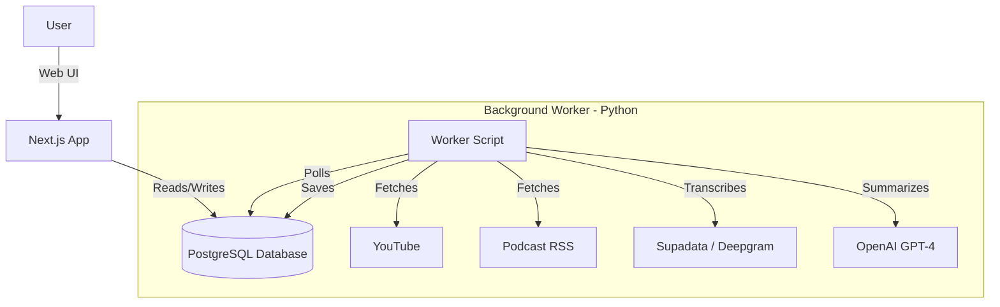

# Engineering Architecture

This document provides a technical overview of the **YouTube RSS Generator** project. It is designed to help engineers and technical stakeholders understand how the system works, how the code is organized, and how data flows through the application.

## 🏗 System Overview

The system is a **hybrid application** consisting of two main parts:
1.  **Web Application (Next.js)**: Handles the User Interface, Authentication, and API endpoints for the frontend.
2.  **Background Worker (Python)**: Handles the heavy lifting—fetching video data, transcribing audio, and generating AI summaries using LLMs.

### High-Level Diagram



---

## 🛠 Technology Stack

### Frontend & API (The "App")
| Technology | Purpose |
|------------|---------|
| Next.js 16 (App Router) | Framework |
| TypeScript | Language |
| Tailwind CSS | Styling |
| React Query | State/Cache |
| NextAuth.js | Auth (Google) |

### Background Worker (The "Brain")
| Technology | Purpose |
|------------|---------|
| Python 3.x | Language |
| pg8000 | DB Access |
| OpenAI API | Summarization |
| Supadata | YT Transcripts |
| Deepgram | Audio Transcripts |

### Database
-   **PostgreSQL** on Supabase.
-   **Prisma** (ORM for Next.js).

---

## 📂 Directory Structure

```
youtube-rss-generator/
├── app/                          # Next.js 應用程式路由
│   ├── api/                      # API 端點
│   ├── episode/[episodeId]/      # Podcast 摘要頁面
│   ├── video/[videoId]/          # 影片摘要頁面
│   ├── feed/page.tsx             # 閱讀動態頁面
│   ├── subscriptions/page.tsx    # 訂閱管理頁面
│   └── page.tsx                  # 首頁
│
├── components/                   # React 元件
│   ├── ui/                       # 基礎元件 (Shadcn + 通用)
│   ├── layout/                   # 導覽結構 (TopNav, UserMenu)
│   ├── auth/                     # 認證相關 (AuthButton, LoginModal)
│   ├── feed/                     # 閱讀功能 (FeedCard, ArticleModal)
│   ├── subscription/             # 訂閱管理 (ChannelManager)
│   └── providers/                # 設定提供者 (QueryProvider, SessionProvider)
│
├── lib/                          # 共用工具
│   └── prisma.ts                 # 資料庫客戶端
│
├── hooks/                        # 自定義 React Hooks
│   ├── useFeed.ts                # 動態內容抓取
│   ├── useSubscriptions.ts       # 訂閱清單
│   ├── useReadStatus.ts          # 已讀狀態追蹤
│   ├── useLocalStorage.ts        # 瀏覽器儲存
│   └── useGuestSync.ts           # 訪客資料同步
│
├── backend/                      # Python Worker (後端)
│   ├── worker/                   # Worker 套件
│   │   ├── youtube.py            # YouTube 擷取
│   │   ├── podcast.py            # Podcast 擷取
│   │   └── summarize.py          # AI 摘要
│   ├── run_worker.sh             # 啟動腳本
│   ├── worker.py                 # 程式入口
│   └── requirements.txt          # Python 依賴套件
│
├── prisma/schema.prisma          # 資料庫架構定義
└── README.md                     # 專案說明文件
```

---

## 🔄 Core Data Flows

### 1. Adding a Channel
```
User pastes URL → POST /api/channels → API validates & saves → Optimistic UI shows card
```

### 2. Generating Content (Worker)
```
Worker starts → Queries subscribed channels → Fetches new videos → Gets transcript → AI summary → Saves to DB
```

### 3. Reading Feed
```
User visits /feed → React Query calls GET /api/feed → API returns items → UI renders FeedCards
```

---

## 🗄 Database Schema (Simplified)

```
┌───────────────┐       ┌─────────────────────┐
│    users      │       │  youtube_channels   │
├───────────────┤       ├─────────────────────┤
│ id            │◄──┐   │ id                  │
│ email         │   │   │ youtube_id          │
└───────────────┘   │   │ title               │
                    │   └─────────────────────┘
                    │              ▲
            ┌───────┴──────────────┴───────┐
            │   youtube_subscriptions      │
            ├──────────────────────────────┤
            │ user_id (FK)                 │
            │ channel_id (FK)              │
            └──────────────────────────────┘
```
*(Same structure for Podcasts)*

---

## 🚀 Development Quick Start

```bash
# Frontend
npm install && npm run dev

# Worker
cd backend
pip install -r requirements.txt
./run_worker.sh
```

---

## 🖥 Deployment Model

This project uses a **split deployment** strategy:

| Component | Where it runs | Notes |
|-----------|---------------|-------|
| **Next.js App** | Vercel (or local) | The web UI and API endpoints. |
| **Python Worker** | **Mac Mini (local server)** | Runs via Cron job every hour to fetch new content and generate AI summaries. |
| **Database** | Supabase (cloud) | PostgreSQL. Shared by both App and Worker. |

### Why Mac Mini?
-   The AI processing (transcription + summarization) is CPU/API intensive and runs on a schedule (hourly).
-   Running it on a dedicated local Mac Mini avoids serverless timeout limits and keeps API costs predictable.
-   Code is synced via `git pull` from GitHub.

### Worker Cron Setup (on Mac Mini)
```bash
# Example crontab entry (run every hour)
# Example crontab entry (run every hour)
0 * * * * /path/to/youtube-rss-generator/backend/run_worker.sh >> /path/to/cron_log.txt 2>&1
```
