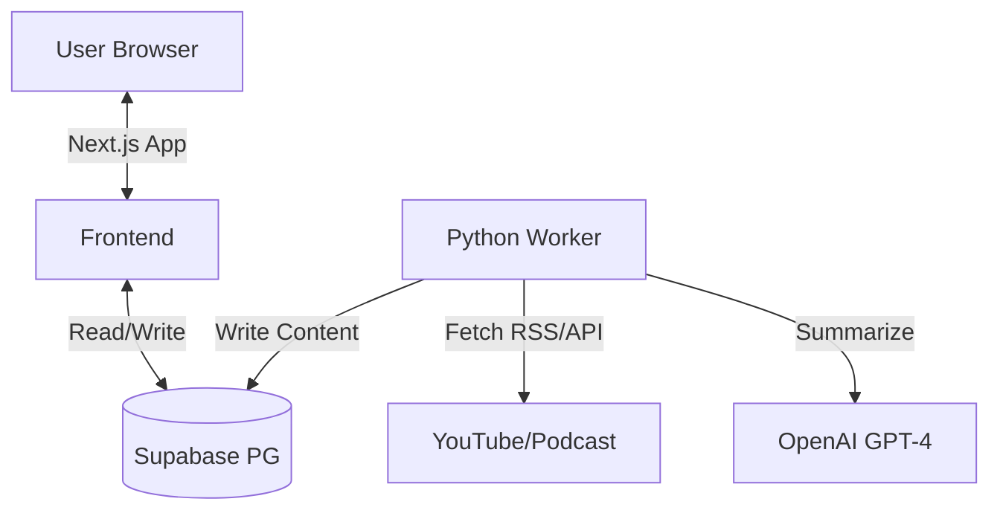

<!--
AI MAINTENANCE GUIDE:
This document is the "Map" of the system.
WHEN UPDATING THIS FILE:
1. Navigation Guide: MUST be updated when new features or major files are added. Map "User Intent" to "File Path".
2. Directory Structure: MUST describe every major file/folder.
3. Data Flow: Keep it simple. Explain "Logical Flow", not implementation details.
-->

# Architecture Documentation

## 🏗 High-Level Architecture

The system consists of three main parts:
1.  **Frontend (Next.js)**: Reads from DB, handles User UI.
2.  **Database (Supabase)**: Stores channels, videos, summaries, and user subscriptions.
3.  **Worker (Python)**: Fetches new content, runs AI summarization, writes to DB.



---

## �️ Navigation Guide (Where do I modify...?)

Use this guide to quickly find the file you need to change based on your intent.

### Frontend (UI & Logic)
| I want to change... | Go to File |
|---------------------|------------|
| **Homepage** (Landing) | `app/page.tsx` |
| **Feed Page** (Reader) | `app/feed/page.tsx` |
| **Subscription Manager** | `components/subscription/ChannelManager/index.tsx` |
| **Colors / Theme** | `app/globals.css` |
| **Button Styles** | `components/ui/Button.tsx` |
| **Card Design** | `components/subscription/ChannelManager/SubscriptionCard.tsx` |
| **Article Modal** | `components/feed/ArticleModal.tsx` |

### Backend (AI & Data)
| I want to change... | Go to File |
|---------------------|------------|
| **AI Summary Prompts** | `backend/worker/summarize.py` |
| **YouTube Fetch Logic** | `backend/worker/youtube.py` |
| **Podcast Fetch Logic** | `backend/worker/podcast.py` |
| **Main Worker Loop** | `backend/worker.py` |
| **Database Schema** | `prisma/schema.prisma` |

---

## 🔄 Data Flow Simplified

Understanding how a video becomes a summary:

1.  **User Adds Channel**: URL sent to `/api/channels` -> Saved to DB.
2.  **Worker Runs**:
    *   Checks DB for all channels.
    *   Fetches latest video list from YouTube/RSS.
    *   If video is new (not in DB) -> Download transcript.
3.  **AI Processing**:
    *   Worker sends transcript to OpenAI.
    *   Receives structured summary.
4.  **Save**: Summary saved to `Video` table in DB.
5.  **Display**: User refreshes `/feed`, frontend fetches from `Video` table.

---

## 📂 Directory Structure

```
youtube-rss-generator/
├── app/                          # Next.js App Router
│   ├── api/                      # Backend API Endpoints
│   ├── feed/page.tsx             # Main Reading Interface
│   ├── subscriptions/page.tsx    # Subscription Management
│   ├── globals.css               # Global Styles & Variables
│   └── page.tsx                  # Landing Page
│
├── components/                   # React Components
│   ├── ui/                       # Reusable UI Blocks
│   │   ├── Button.tsx            # Standard Button
│   │   ├── IconButton.tsx        # Icon-only Button
│   │   ├── Input.tsx             # Form Input
│   │   ├── Badge.tsx             # Status/Type Label
│   │   ├── dialog.tsx            # Modal Base (Shadcn)
│   │   └── ...
│   │
│   ├── layout/                   # Layout Components (Nav, Menu)
│   ├── feed/                     # Feed Components
│   │   ├── FeedCard.tsx          # The article card in the feed
│   │   └── ArticleModal.tsx      # The popup reader view
│   │
│   └── subscription/             # Subscription Components
│       └── ChannelManager/       # The complex subscription manager
│           ├── index.tsx         # Logic for add/remove/refresh
│           ├── SubscriptionCard.tsx  # The visual card for channels
│           └── AddChannelForm.tsx    # The input form
│
├── lib/                          # Utilities
│   ├── prisma.ts                 # Database Client
│   └── utils.ts                  # Helper Functions
│
├── hooks/                        # Custom React Hooks
│   ├── useFeed.ts                # Data fetching for feed
│   └── useSubscriptions.ts       # Data fetching for subs
│
├── backend/                      # Python Worker (The "Brain")
│   ├── worker/                   # Core Logic Modules
│   │   ├── summarize.py          # AI Prompts & Logic
│   │   └── youtube.py            # YouTube API Handling
│   ├── worker.py                 # Main Entry Point
│   └── requirements.txt          # Python Dependencies
│
└── prisma/schema.prisma          # Database Schema Definition
```

---

## 🗄 Database Schema (Key Concepts)

*   **Channel**: A YouTube channel or Podcast feed.
*   **Video**: An individual episode or video. Contains the `summary` and `transcript`.
*   **Subscription**: Link between a `User` and a `Channel`.
*   **UserVideo**: Tracks read status (`is_read`) for each user/video pair.
