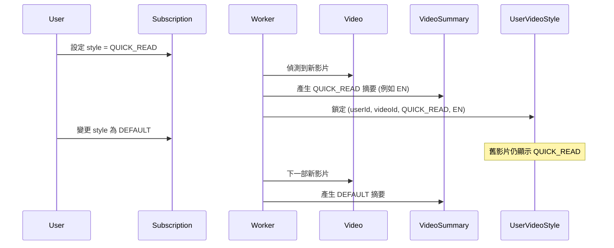

# 代碼結構與架構說明 (Code Structure)

<!--
AI 維護指南：
這份文件是系統的「地圖」。
當更新此檔案時：
1. 導覽指南：每當新增功能或主要檔案時必須更新。將「使用者意圖」對應到「檔案路徑」。
2. 目錄結構：必須描述每個主要檔案/資料夾。
3. 資料流：保持簡單。解釋「邏輯流程」，而非實作細節。
-->

## 🏗 高層架構

本系統由三個主要部分組成：

1.  **前端 (Frontend - Next.js)**：讀取資料庫，處理使用者介面 (UI)。
2.  **資料庫 (Database - Supabase)**：儲存頻道、影片、摘要和使用者訂閱資訊。
3.  **Worker (Python)**：擷取新內容，執行 AI 摘要，寫入資料庫。

```mermaid
graph TD
    User[使用者瀏覽器] <-->|Next.js App| Frontend
    Frontend <-->|讀取/寫入| DB[(Supabase PG)]
    
    Worker[Python Daemon] -->|輪詢 (Poll)| DB[(佇列 Queue)]
    Worker -->|擷取 RSS/API| YouTube[YouTube/Podcast]
    Worker -->|摘要| OpenAI[OpenAI GPT-4]
    Worker -->|寫入內容| DB
```

### 前端架構 (React Query & State)
*   **單一事實來源 (Single Source of Truth)**：React Query Cache (`useSubscriptions`) 是所有訂閱資料的主狀態。
*   **樂觀 UI (Optimistic UI)**：所有變更操作 (新增/刪除) 使用 `onMutate` 立即更新快取顯示暫存資料，並在 `onSuccess` 時置換為真實資料 (或在 `onError` 時回復)。
*   **UI 元件**：單純渲染來自快取資料的笨元件 (Dumb components)。`useChannelManager` 處理 *UI 狀態* (模態框、表單)，但將 *資料邏輯* 委派給 `useSubscriptions` hooks。

---

## 🧭 導覽指南 (我該去哪裡修改...？)

使用此指南根據你的意圖快速找到需要修改的檔案。

### 前端 (UI 與邏輯)
| 我想要修改... | 前往檔案 |
|---------------------|------------|
| **首頁** (Landing) | `app/[locale]/page.tsx` |
| **閱讀頁面** (Feed) | `app/[locale]/feed/page.tsx` |
| **訂閱管理器** | `components/subscription/ChannelManager/index.tsx` |
| **訂閱變更 (新增/刪除)** | `hooks/useSubscriptions.ts` (核心邏輯) |
| **訂閱 UI 狀態 (模態框)** | `components/subscription/ChannelManager/useChannelManager.ts` |
| **顏色 / 主題** | `app/globals.css` |
| **按鈕樣式** | `components/ui/Button.tsx` |
| **卡片設計** | `components/subscription/ChannelManager/SubscriptionCard.tsx` |
| **摘要風格選擇器** | `components/ui/StyleSelector.tsx` |
| **文章模態框** | `components/feed/ArticleModal.tsx` |
| **i18n 翻譯** | `messages/en.json`, `messages/zh-TW.json` |
| **i18n 路由** | `routing.ts`, `middleware.ts` |

### 後端 (AI 與資料)
| 我想要修改... | 前往檔案 |
|---------------------|------------|
| **AI 摘要提示詞 (Prompts)** | `backend/worker/summarize.py` |
| **逐字稿擷取** | `backend/worker/transcribe.py` (多層級：免費 API → Supadata → Deepgram) |
| **YouTube 擷取邏輯** | `backend/worker/youtube.py` |
| **Podcast 擷取邏輯** | `backend/worker/podcast.py` |
| **Worker 共享邏輯** | `backend/worker/common.py` (共享工具：多語言摘要檢查 `ensure_missing_summaries`) |
| **Worker 清理** | `backend/worker/cleanup.py` (影片保留策略 - 上限 15 部) |
| **Worker 設定** | `backend/worker/config.py` (API 限制、冷卻時間) |
| **Worker 常駐程式** | `backend/worker/daemon.py` (新進入點) |
| **主要 Worker 迴圈** | `backend/worker.py` (舊版/例行程序) |
| **資料庫架構** | `prisma/schema.prisma` |
| **風格更新 API** | `app/api/subscriptions/style/route.ts` |
| **個人化 RSS Feed** | `app/feed/user/[token]/route.ts` |
| **API 共享工具** | `lib/api-utils.ts` (配額/Worker 觸發) |
| **安全性驗證** | `lib/security.ts` (SSRF 防護) |

---

## 🔄 資料流簡述

了解影片如何變成摘要的流程：

1.  **使用者新增頻道**：
    *   URL 發送到 `/api/channels` (由 `lib/security.ts` 驗證)。
    *   頻道儲存到 DB。
    *   **新**：建立一個 `ProcessingQueue` 工作 (狀態：PENDING)。
2.  **Worker 執行 (即時)**：
    *   Daemon 每 10 秒輪詢 DB。
    *   獲取工作 → 擷取內容 → 摘要。
3.  **逐字稿擷取 (YouTube)**：
    ```
    ┌─────────────────────────────────────────┐
    │ 1. 免費 API (youtube-transcript-api)    │
    │    ├─ 每日限制：10 次調用               │
    │    └─ 冷卻：調用間隔 30 分鐘            │
    │              ↓ (失敗或冷卻中)           │
    │ 2. Supadata API (付費)                  │
    │              ↓ (無字幕)                 │
    │ 3. Deepgram + yt-dlp (音訊 → STT)       │
    └─────────────────────────────────────────┘
    ```
4.  **顯示**：
    *   使用者最初看到「處理中 (Processing)」狀態。
    *   一旦 Worker 完成，Feed 會自動更新 (重新整理時)。
5.  **保留策略**：
    *   Worker 自動保留每個頻道最新的 **15 部影片**。
    *   較舊的內容會被連鎖刪除以維護資料庫健康。

---

## 📂 目錄結構詳細說明

```
youtube-rss-generator/
├── app/                          # Next.js App Router (應用程式路由)
│   ├── [locale]/                 # i18n 語系路由
│   │   ├── page.tsx              # 登陸頁面 (Landing Page)
│   │   ├── feed/page.tsx         # 主要閱讀介面
│   │   └── subscriptions/page.tsx # 訂閱管理
│   ├── api/                      # 後端 API 端點
│   └── globals.css               # 全域樣式與變數
│
├── components/                   # React 元件
│   ├── ui/                       # 可重複使用的 UI 區塊
│   │   ├── Button.tsx            # 標準按鈕
│   │   ├── IconButton.tsx        # 圖示按鈕
│   │   ├── Input.tsx             # 表單輸入框
│   │   ├── Badge.tsx             # 狀態/類型標籤
│   │   ├── StyleSelector.tsx     # 摘要風格選擇器
│   │   ├── LanguageSelector.tsx  # 摘要語言選擇器
│   │   ├── dialog.tsx            # 模態框基礎 (Shadcn)
│   │   └── tabs.tsx              # 分頁元件
│   │
│   ├── layout/                   # 版面配置元件 (導航、選單)
│   ├── feed/                     # Feed 相關元件
│   │   ├── FeedCard.tsx          # Feed 中的文章卡片
│   │   └── ArticleModal.tsx      # 彈出閱讀視窗
│   │
│   └── subscription/             # 訂閱相關元件
│       └── ChannelManager/       # 複雜的訂閱管理器
│           ├── index.tsx         # 新增/移除/重新整理的邏輯
│           ├── useChannelManager.ts # 自定義 Hook (狀態/邏輯)
│           ├── SubscriptionCard.tsx  # 頻道的視覺卡片
│           └── AddChannelForm.tsx    # 輸入表單
│
├── messages/                     # i18n 翻譯檔案
│   ├── en.json                   # 英文翻譯
│   └── zh-TW.json                # 繁體中文翻譯
│
├── lib/                          # 工具庫
│   ├── prisma.ts                 # 資料庫客戶端
│   ├── utils.ts                  # 輔助函式
│   ├── api-utils.ts              # 共享 API 輔助 (Auth/配額)
│   └── security.ts               # 安全驗證器 (SSRF)
│
├── hooks/                        # 自定義 React Hooks
│   ├── useFeed.ts                # Feed 資料擷取
│   ├── useSubscriptions.ts       # 訂閱資料擷取
│   └── useReadStatus.ts          # 本地端閱讀狀態儲存
│
├── backend/                      # Python Worker (系統的「大腦」)
│   ├── worker/                   # 核心邏輯模組
│   │   ├── config.py             # 設定與常數 (含 API 限制)
│   │   ├── common.py             # 共享 Worker 工具
│   │   ├── cleanup.py            # 影片保留邏輯
│   │   ├── daemon.py             # 即時輪詢引擎
│   │   ├── transcribe.py         # 多層級逐字稿擷取
│   │   ├── summarize.py          # AI 提示詞與邏輯
│   │   ├── youtube.py            # YouTube API 處理
│   │   └── podcast.py            # Podcast API 處理
│   ├── worker.py                 # (舊版) 完整掃瞄程序
│   ├── run_worker.sh             # 啟動腳本
│   └── requirements.txt          # Python 依賴套件
│
├── routing.ts                    # i18n 路由設定
├── i18n.ts                       # i18n 請求設定
├── middleware.ts                 # Next.js 中介軟體 (Auth + i18n)
│
├── public/                       # 靜態資源
│   └── logo.png                  # 應用程式 Logo
│
└── prisma/                       # 資料庫
    └── schema.prisma             # 資料庫架構定義
```

---

## 🗄 資料庫架構 (核心概念)

### 核心資料表 (Core Tables)
*   **Channel**：YouTube 頻道 (`youtube_channels`) 或 Podcast feed (`podcast_channels`)。
*   **Video/Episode**：個別內容項目，包含逐字稿 (`transcript`)。
*   **Subscription**：連結 `User` 和 `Channel`，包含 `summaryStyle` (摘要風格) 偏好。
*   **ProcessingQueue**：追蹤背景工作以進行即時處理。

### 摘要風格資料表 (Summary Style Tables)
*   **VideoSummary / EpisodeSummary**：每個內容、每個風格、**每個語言**儲存一份摘要。一部影片可以有多個摘要 (例如 DEFAULT-EN, DEFAULT-ZH, QUICK-EN...)。
*   **UserVideoStyle / UserEpisodeStyle**：在處理時為每個使用者**鎖定**風格與語言。確保 RSS feed 穩定性 - 風格/語言變更僅影響未來的內容。
*   **User.feedToken**：個人化 RSS feed 的唯一權杖 (`/feed/user/[token]`)。

### 鎖定風格設計 (Locked Styles Design)


## 🔗 關鍵相依性 (修改前必讀)

本節明確列出系統中**耦合**的部分。如果你修改其中一個，必須檢查另一個。

### 1. 資料庫架構 ↔ Python Worker
*   **情境**：Python worker (`backend/worker/`) 使用原生 SQL 或 DB 驅動程式，預期 `prisma/schema.prisma` 中定義的確切資料表結構。
*   **規則**：如果你修改 `prisma/schema.prisma` (特別是資料表名稱或欄位名稱)，你必須在 `backend/worker` 目錄中使用 grep 搜尋舊名稱並更新 SQL查詢/邏輯。
*   **風險**：如果佇列資料表架構變更，Worker 將會無聲崩潰或無法擷取工作。

### 2. 處理佇列狀態 ↔ UI 回饋
*   **情境**：前端監控 `ProcessingQueue` 狀態 (PENDING, PROCESSING, COMPLETED, FAILED)。
*   **規則**：這些狀態字串在 `backend/worker/daemon.py` (或 `common.py`) 和 `prisma/schema.prisma` 中是硬編碼 (HARDCODED) 的。
*   **風險**：在 Prisma 更改 Status Enum 但未更新 Python Worker 的狀態機，將導致 UI 無限顯示「處理中」旋轉圖示。

### 3. 摘要風格 Enums ↔ 風格選擇器
*   **情境**：`SummaryStyle` (DEFAULT, QUICK_READ) 和 `SummaryLanguage` 是 Enums。
*   **規則**：如果你新增一個 Style：
    1.  新增至 `prisma/schema.prisma`。
    2.  新增至前端 `components/ui/StyleSelector.tsx`。
    3.  在 `backend/worker/summarize.py` 新增提示詞邏輯。
*   **風險**：使用者選擇了新風格，但 Worker 預設回退到 "DEFAULT"，因為它不知道新的 Enum 值。

### 4. YouTube API ↔ 配額管理
*   **情境**：`backend/worker/youtube.py` 和 `config.py` 管理每日限制。
*   **規則**：不要為了「修復」影片無法擷取的錯誤而繞過 `config.py` 的限制。限制存在是有原因的 (成本/防止被封鎖)。

### 5. 訂閱層級 (Subscription Tier) ↔ 多個檔案
*   **情境**：`SubscriptionTier` Enum 定義在 `prisma/schema.prisma` 並且在 `lib/types/subscription-tier.ts` 中手動定義類型。
*   **規則**：當新增一個 Tier 時：
    1.  新增至 `prisma/schema.prisma`。
    2.  新增至 `lib/types/subscription-tier.ts` (更新 `SubscriptionTier` type + `TIER_LIMITS`)。
    3.  更新前端 `components/layout/TopNav.tsx` 的徽章邏輯。
    4.  (選項) 更新 `messages/*.json` 中的 i18n。
*   **風險**：如果手動 TypeScript 類型未更新，即使 VS Code 看起來正常，建置仍會失敗 (因為生成的 client 延遲)。
