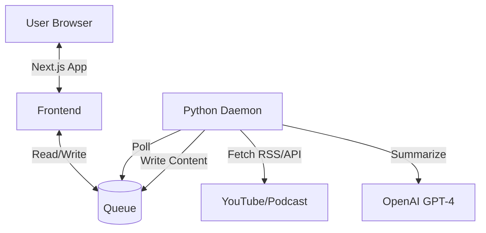
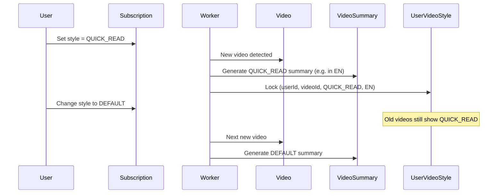

<!--
AI MAINTENANCE GUIDE:
This document is the "Map" of the system.
WHEN UPDATING THIS FILE:
1. Navigation Guide: MUST be updated when new features or major files are added. Map "User Intent" to "File Path".
2. Directory Structure: MUST describe every major file/folder.
3. Data Flow: Keep it simple. Explain "Logical Flow", not implementation details.
-->

# Architecture Documentation

## 🏗 High-Level Architecture

The system consists of three main parts:
1.  **Frontend (Next.js)**: Reads from DB, handles User UI.
2.  **Database (Supabase)**: Stores channels, videos, summaries, and user subscriptions.
3.  **Worker (Python)**: Fetches new content, runs AI summarization, writes to DB.



### Frontend Architecture (React Query & State)
*   **Single Source of Truth**: The React Query Cache (`useSubscriptions`) is the master state for all subscription data.
*   **Optimistic UI**: All mutations (Add/Delete) use `onMutate` to immediately update the cache with temporary data, and `onSuccess` to swap in real data (or `onError` to rollback).
*   **UI Components**: Dumb components that render data from the cache. `useChannelManager` handles *UI state* (modals, forms) but delegates *Data Logic* to `useSubscriptions` hooks.

---

## 🧭 Navigation Guide (Where do I modify...?)

Use this guide to quickly find the file you need to change based on your intent.

### Frontend (UI & Logic)
| I want to change... | Go to File |
|---------------------|------------|
| **Homepage** (Landing) | `app/[locale]/page.tsx` |
| **Feed Page** (Reader) | `app/[locale]/feed/page.tsx` |
| **Subscription Manager** | `components/subscription/ChannelManager/index.tsx` |
| **Subscription mutations (Add/Delete)** | `hooks/useSubscriptions.ts` (Core Logic) |
| **Subscription UI State (Modals)** | `components/subscription/ChannelManager/useChannelManager.ts` |
| **Colors / Theme** | `app/globals.css` |
| **Button Styles** | `components/ui/Button.tsx` |
| **Card Design** | `components/subscription/ChannelManager/SubscriptionCard.tsx` |
| **Summary Style Selector** | `components/ui/StyleSelector.tsx` |
| **Article Modal** | `components/feed/ArticleModal.tsx` |
| **Share Button** | `components/ui/ShareButton.tsx` |
| **CTA Banner** (Public pages) | `components/ui/CTABanner.tsx` |
| **Public Video Summary** | `app/[locale]/video/[videoId]/page.tsx` |
| **Public Episode Summary** | `app/[locale]/episode/[episodeId]/page.tsx` |
| **i18n Translations** | `messages/en.json`, `messages/zh-TW.json` |
| **i18n Routing** | `routing.ts`, `middleware.ts` |

### Backend (AI & Data)
| I want to change... | Go to File |
|---------------------|------------|
| **AI Summary Prompts** | `backend/worker/summarize.py` |
| **Transcript Fetching** | `backend/worker/transcribe.py` (Multi-tier: Free API → Supadata → yt-dlp+Whisper) |
| **YouTube Channel Orchestration** | `backend/worker/youtube.py` (Main loop, subscriber mgmt, error handling) |
| **YouTube Metadata Fetching** | `backend/services/youtube_metadata.py` (RSS, Scrapetube, Shorts detection) |
| **Podcast Fetch Logic** | `backend/worker/podcast.py` |
| **Worker Shared Logic** | `backend/worker/common.py` (Shared Utils: Multi-language checks `ensure_missing_summaries`) |
| **Worker Cleanup** | `backend/worker/cleanup.py` (Video Retention Policy - 15 limit) |
| **Worker Config** | `backend/worker/config.py` (API limits, cooldowns) |
| **Worker Daemon** | `backend/worker/daemon.py` (New Entry Point) |
| **Main Worker Loop** | `backend/worker.py` (Legacy/Routine) |
| **Database Schema** | `prisma/schema.prisma` |
| **Style Update API** | `app/api/subscriptions/style/route.ts` |
| **Personalized RSS Feed** | `app/feed/user/[token]/route.ts` |
| **API Shared Utilities** | `lib/api-utils.ts` (Quota/Worker triggers) |
| **Security Validation** | `lib/security.ts` (SSRF Protection) |
| **Unit Tests** | `tests/` (pytest-based tests for services and worker modules) |

---

## 🔄 Data Flow Simplified

Understanding how a video becomes a summary:

1.  **User Adds Channel**:
    *   URL sent to `/api/channels` (Validated by `lib/security.ts`).
    *   Channel saved to DB.
    *   **New**: A `ProcessingQueue` job is created (Status: PENDING).
2.  **Worker Runs (Real-time)**:
    *   Daemon polls DB every 10s.
    *   Picks up the job → Fetches content → Summarizes.
3.  **Transcript Fetching (YouTube)**:
    ```
    ┌─────────────────────────────────────────┐
    │ 1. Free API (youtube-transcript-api)    │
    │    ├─ Daily limit: 10 calls             │
    │    └─ Cooldown: 30 min between calls    │
    │              ↓ (fail or cooldown)       │
    │ 2. Supadata API (paid)                  │
    │              ↓ (no subtitles)           │
    │ 3. yt-dlp + Whisper (audio → STT)       │
    │    └─ Located in: transcribe.py         │
    └─────────────────────────────────────────┘
    ```
4.  **Display**:
    *   User sees "Processing" state initially.
    *   Once worker finishes, feed auto-updates (on refresh).
5.  **Retention Policy**:
    *   Worker automatically keeps only the latest **15 videos** per channel.
    *   Older content is cascade-deleted to maintain database health.

---

## 📂 Directory Structure

```
youtube-rss-generator/
├── app/                          # Next.js App Router
│   ├── [locale]/                 # i18n Locale Routes
│   │   ├── page.tsx              # Landing Page
│   │   ├── feed/page.tsx         # Main Reading Interface
│   │   └── subscriptions/page.tsx # Subscription Management
│   ├── api/                      # Backend API Endpoints
│   └── globals.css               # Global Styles & Variables
│
├── components/                   # React Components
│   ├── ui/                       # Reusable UI Blocks
│   │   ├── Button.tsx            # Standard Button
│   │   ├── IconButton.tsx        # Icon-only Button
│   │   ├── Input.tsx             # Form Input
│   │   ├── Badge.tsx             # Status/Type Label
│   │   ├── StyleSelector.tsx     # Summary Style Picker
│   │   ├── LanguageSelector.tsx  # Summary Language Picker (NEW)
│   │   ├── ShareButton.tsx       # Copy-to-clipboard Share
│   │   ├── CTABanner.tsx         # CTA for Public Pages
│   │   ├── dialog.tsx            # Modal Base (Shadcn)
│   │   └── tabs.tsx              # Tab Component
│   │
│   ├── layout/                   # Layout Components (Nav, Menu)
│   ├── feed/                     # Feed Components
│   │   ├── FeedCard.tsx          # The article card in the feed
│   │   └── ArticleModal.tsx      # The popup reader view
│   │
│   └── subscription/             # Subscription Components
│       └── ChannelManager/       # The complex subscription manager
│           ├── index.tsx         # Logic for add/remove/refresh
│           ├── useChannelManager.ts # Custom Hook (State/Logic)
│           ├── SubscriptionCard.tsx  # The visual card for channels
│           └── AddChannelForm.tsx    # The input form
│
├── messages/                     # i18n Translation Files
│   ├── en.json                   # English translations
│   └── zh-TW.json                # Traditional Chinese translations
│
├── lib/                          # Utilities
│   ├── prisma.ts                 # Database Client
│   ├── utils.ts                  # Helper Functions (incl. stripHtml)
│   ├── rss-utils.ts              # RSS Feed Helpers (Share Footer)
│   ├── api-utils.ts              # Shared API Helpers (Auth/Quota)
│   └── security.ts               # Security Validators (SSRF)
│
├── hooks/                        # Custom React Hooks
│   ├── useFeed.ts                # Data fetching for feed
│   ├── useSubscriptions.ts       # Data fetching for subs
│   └── useReadStatus.ts          # Local storage for read status
│
├── backend/                      # Python Worker (The "Brain")
│   ├── services/                 # Service Layer (Reusable Business Logic)
│   │   ├── __init__.py           # Package marker
│   │   └── youtube_metadata.py   # YouTube metadata fetching (RSS, Scrapetube, Shorts detection)
│   ├── worker/                   # Core Worker Modules (Orchestration)
│   │   ├── config.py             # Configuration & Constants (incl. API limits)
│   │   ├── common.py             # Shared Worker Utilities
│   │   ├── cleanup.py            # Video Retention Logic
│   │   ├── daemon.py             # Real-time Polling Engine
│   │   ├── transcribe.py         # Multi-tier Transcript Fetching (incl. yt-dlp+Whisper)
│   │   ├── summarize.py          # AI Prompts & Logic
│   │   ├── youtube.py            # YouTube Channel Orchestration (~200 lines)
│   │   └── podcast.py            # Podcast API Handling
│   ├── worker.py                 # (Legacy) Full Scan Routine
│   ├── run_worker.sh             # Launch Script
│   └── requirements.txt          # Python Dependencies
│
├── tests/                        # Python Unit Tests (pytest)
│   ├── __init__.py               # Package marker
│   ├── test_youtube_metadata.py  # Tests for youtube_metadata service (22 tests)
│   └── test_transcribe.py        # Tests for transcribe module (6 tests)
│
├── routing.ts                    # i18n Routing Config
├── i18n.ts                       # i18n Request Config
├── middleware.ts                 # Next.js Middleware (Auth + i18n)
│
├── public/                       # Static Assets
│   └── logo.png                  # App Logo (TubeSummary)
│
└── prisma/                       # Database
    └── schema.prisma             # Database Schema Definition
```

---

## 🗄 Database Schema (Key Concepts)

### Core Tables
*   **Channel**: A YouTube channel (`youtube_channels`) or Podcast feed (`podcast_channels`).
*   **Video/Episode**: Individual content items with `transcript`.
*   **Subscription**: Link between `User` and `Channel`, includes `summaryStyle` preference.
*   **ProcessingQueue**: Tracks background jobs for real-time processing.

### Summary Style Tables
*   **VideoSummary / EpisodeSummary**: Stores summaries per content, per style, **per language**. One video can have multiple summaries (e.g. DEFAULT-EN, DEFAULT-ZH, QUICK-EN...).
*   **UserVideoStyle / UserEpisodeStyle**: **Locks** the style AND language for each user at processing time. Ensures RSS feed stability - style/language changes only affect future content.
*   **User.feedToken**: Unique token for personalized RSS feed (`/feed/user/[token]`).

### Locked Styles Design


## 🔗 Critical Dependencies (READ THIS to avoid "Fix A Break B")

This section explicitly lists **coupled** parts of the system. If you touch one, you MUST check the other.

### 1. Database Schema ↔ Python Worker
*   **Context**: The Python worker (`backend/worker/`) uses raw SQL or a DB driver that expects the exact table structure defined in `prisma/schema.prisma`.
*   **Rule**: If you modify `prisma/schema.prisma` (especially table names or column names), you MUST grep the `backend/worker` directory for the old name and update the SQL queries/logic accordingly.
*   **Risk**: The worker will crash silently or fail to pick up jobs if the queue table schema changes.

### 2. Processing Queue Status ↔ UI Feedback
*   **Context**: The Frontend monitors `ProcessingQueue` status (PENDING, PROCESSING, COMPLETED, FAILED).
*   **Rule**: These status strings are HARDCODED in `backend/worker/daemon.py` (or `common.py`) and `prisma/schema.prisma`.
*   **Risk**: Changing a Status Enum in Prisma without updating the Python Worker's state machine will cause infinite "Processing" spinners in the UI.

### 3. Summary Style Enums ↔ Style Selector
*   **Context**: `SummaryStyle` (DEFAULT, QUICK_READ) and `SummaryLanguage` are Enums.
*   **Rule**: If you add a new Style:
    1.  Add to `prisma/schema.prisma`.
    2.  Add to Frontend `components/ui/StyleSelector.tsx`.
    3.  Add prompt logic in `backend/worker/summarize.py`.
*   **Risk**: Users select a new style, but the Worker defaults to "DEFAULT" because it doesn't know the new Enum value.

### 4. YouTube API ↔ Quota Management
*   **Context**: `backend/worker/youtube.py` and `config.py` manage daily limits.
*   **Rule**: Do not bypass `config.py` limits to "fix" a bug where videos aren't fetching. The limit is there for a reason (cost/ban prevention).

### 5. YouTube Worker ↔ Services Layer
*   **Context**: `backend/worker/youtube.py` imports from `backend/services/youtube_metadata.py`.
*   **Rule**: The service layer (`services/`) contains pure functions for data fetching (RSS, Scrapetube). The worker layer (`worker/`) handles orchestration, DB operations, and error handling.
*   **Functions in `youtube_metadata.py`**:
    - `fetch_videos_from_rss()` - Primary method for video list
    - `fetch_videos_from_scrapetube()` - Fallback method
    - `is_short_video()` - Shorts detection via HTTP redirect
    - `parse_relative_time()` - Parse "3 days ago" to datetime
*   **Risk**: If you modify the return format of service functions, update `youtube.py` accordingly.

### 6. Subscription Tier ↔ Multiple Files
*   **Context**: `SubscriptionTier` Enum is defined in `prisma/schema.prisma` AND manually typed in `lib/types/subscription-tier.ts`.
*   **Rule**: When adding a new Tier:
    1.  Add to `prisma/schema.prisma`.
    2.  Add to `lib/types/subscription-tier.ts` (update `SubscriptionTier` type + `TIER_LIMITS`).
    3.  Update Frontend badge logic in `components/layout/TopNav.tsx`.
    4.  (Optional) Update i18n in `messages/*.json`.
*   **Risk**: If the manual TypeScript type isn't updated, the build will fail even if VS Code looks fine (due to generated client lag).
